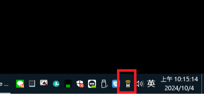
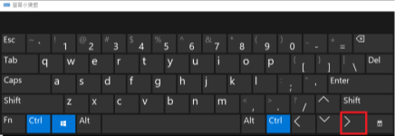
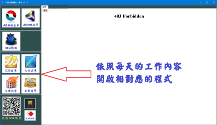
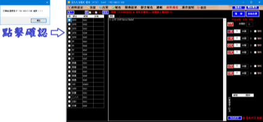
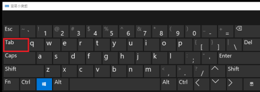
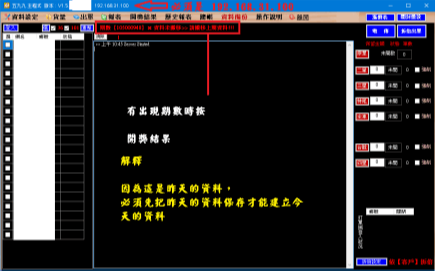
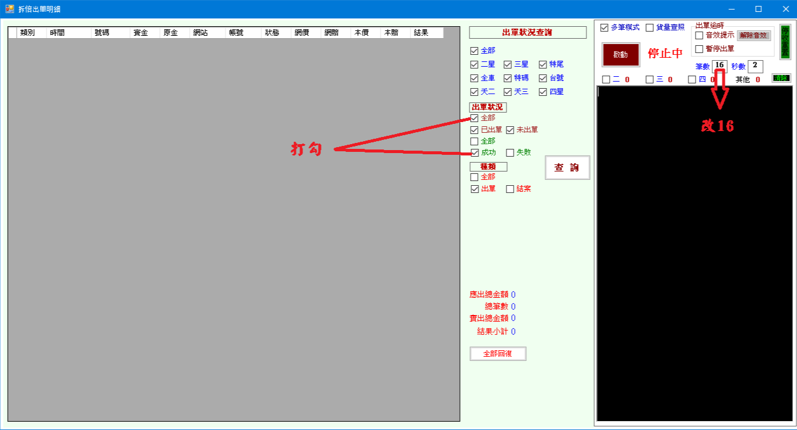

<!DOCTYPE html>
<html >
<head>
  <!-- Site made with Mobirise Website Builder v4.7.8, https://mobirise.com -->
  <meta charset="UTF-8">
  <meta http-equiv="X-UA-Compatible" content="IE=edge">
  <meta name="generator" content="Mobirise v4.7.8, mobirise.com">
  <meta name="viewport" content="width=device-width, initial-scale=1, minimum-scale=1">
  <link rel="shortcut icon" href="assets/images/logo4.png" type="image/x-icon">
  <meta name="description" content="">
  <title>Home</title>
  <link rel="stylesheet" href="assets/tether/tether.min.css">
  <link rel="stylesheet" href="assets/bootstrap/css/bootstrap.min.css">
  <link rel="stylesheet" href="assets/bootstrap/css/bootstrap-grid.min.css">
  <link rel="stylesheet" href="assets/bootstrap/css/bootstrap-reboot.min.css">
  <link rel="stylesheet" href="assets/animatecss/animate.min.css">
  <link rel="stylesheet" href="assets/theme/css/style.css">
  <link rel="stylesheet" href="assets/mobirise/css/mbr-additional.css" type="text/css">
  
  
  
</head>
<body>
  <section class="mbr-section content6 cid-uqcjp3zvFH" id="content6-g">
    
     
    
    

        

            

                

                    

                        
                    

                    

                        

                            
<strong> </strong><strong>檢查VPN</strong>

                        

                    

                

            

        

    

</section>

<section class="engine"><a href="https://mobirise.me">Mobirise</a></section><section class="mbr-section content7 cid-uqcjH77wXx" id="content7-h">
          
    

    

        

            

                

                    

                        

                            
<strong> </strong><strong>斷開VPN</strong>

                        

                    

                    

                       
                    

                

            

        

    

</section>

<section class="mbr-section content6 cid-uqclK97naR" id="content6-i">
    
     
    
    

        

            

                

                    

                        
                    

                    

                        

                            
 <strong>切換第二個視窗　</strong> <strong>Ctrl 和 Win 按住後</strong> <strong>在按 方向鍵＞&nbsp;</strong>

                        

                    

                

            

        

    

</section>

<section class="mbr-section content7 cid-uqcmoVlqlS" id="content7-j">
          
    

    

        

            

                

                    

                        

                            
  <strong>外帳主程式</strong> <strong> </strong>

                        

                    

                    

                       
                    

                

            

        

    

</section>

<section class="mbr-section content6 cid-uqcnChp8VD" id="content6-k">
    
     
    
    

        

            

                

                    

                        
                    

                    

                        

                            
  <strong>539主程式</strong>  

                        

                    

                

            

        

    

</section>

<section class="mbr-section content6 cid-uqcp0JRVMk" id="content6-l">
    
     
    
    

        

            

                

                    

                        
                    

                    

                        

                            
<strong>切換第一個視窗</strong> <strong>Win + Tab</strong>

                        

                    

                

            

        

    

</section>

<section class="cid-uqcq1pVGxE" id="video1-n">

    
    
    <figure class="mbr-figure align-center container">
        

            
<iframe class="mbr-embedded-video" src="https://www.youtube.com/embed/OWfwm1IFvVM?rel=0&amp;amp;showinfo=0&amp;autoplay=0&amp;loop=0" width="1280" height="720" frameborder="0" allowfullscreen></iframe>

        

    </figure>
</section>

<section class="mbr-section content6 cid-uqctuA9nXc" id="content6-o">
    
     
    
    

        

            

                

                    

                        
                    

                    

                        

                            
<strong>連線位置必須是 192.168.31.100</strong>  <strong>出現期別未搬移記得先搬移</strong>

                        

                    

                

            

        

    

</section>

<section class="cid-uqctRwZ9pC" id="video1-q">

    
    
    <figure class="mbr-figure align-center container">
        

            
<iframe class="mbr-embedded-video" src="https://www.youtube.com/embed/TcPwfuumlIs?rel=0&amp;amp;showinfo=0&amp;autoplay=0&amp;loop=0" width="1280" height="720" frameborder="0" allowfullscreen></iframe>

        

    </figure>
</section>

<section class="cid-uqcu3E0uqi" id="video1-r">

    
    
    <figure class="mbr-figure align-center container">
        

            
<iframe class="mbr-embedded-video" src="https://www.youtube.com/embed/9t5oxbfLk-s?rel=0&amp;amp;showinfo=0&amp;autoplay=0&amp;loop=0" width="1280" height="720" frameborder="0" allowfullscreen></iframe>

        

    </figure>
</section>

<section class="cid-uqcubr3Nc4" id="video1-s">

    
    
    <figure class="mbr-figure align-center container">
        

            
<iframe class="mbr-embedded-video" src="https://www.youtube.com/embed/0ZnB7VdMh00?rel=0&amp;amp;showinfo=0&amp;autoplay=0&amp;loop=0" width="1280" height="720" frameborder="0" allowfullscreen></iframe>

        

    </figure>
</section>

<section class="cid-uqcunvL7sr" id="image1-u">

    

    <figure class="mbr-figure container">
            

                
                
            

    </figure>
</section>

<section class="cid-uqcuDEZBEh" id="video1-v">

    
    
    <figure class="mbr-figure align-center container">
        

            
<iframe class="mbr-embedded-video" src="https://www.youtube.com/embed/2XdWuWFChgQ?rel=0&amp;amp;showinfo=0&amp;autoplay=0&amp;loop=0" width="1280" height="720" frameborder="0" allowfullscreen></iframe>

        

    </figure>
</section>

  
  
  
  
  
  
  
  
  
  
 
<a style="text-align: center;"><i></i></a>

    <input name="animation" type="hidden">
  </body>
</html>
